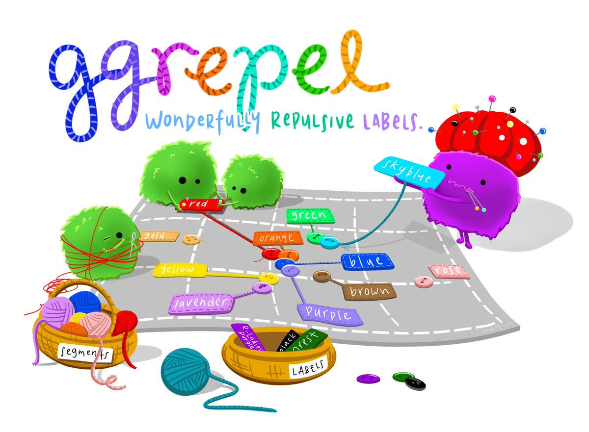
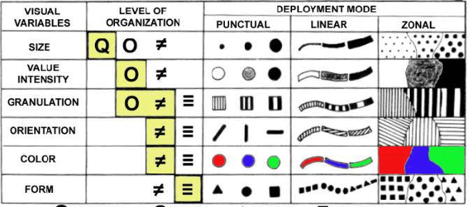

# This Week we are introduced to more R packages.Besides tidyverse, we will use:

-   ggrepel: an R package provides geoms for ggplot2 to repel overlapping text labels.

-   ggthemes: an R package provides some extra themes, geoms, and scales for ‘ggplot2’.

-   hrbrthemes: an R package provides typography-centric themes and theme components for ggplot2.

-   patchwork: an R package for preparing composite figure created using ggplot2.

-   skimr (Bonus): an R package designed to provide detact and compact summary statistics for data frames, tibbles and vectors. i added this library to have an equivalent of panda's describe

-   dplyr(bonus): an R package designed to make data manipulation fast, readable, and consistent. Some useful Functions are

::: {.callout-tip collapse="true"}
```         
-   mutate() adds new variables that are functions of existing variables
-   select() picks variables based on their names.
-   filter() picks cases based on their values.
-   summarise() reduces multiple values down to a single summary.
-   arrange() changes the ordering of the rows.
-   %\>% or \|\> are used to chain commands
```
:::

```{r, warning=FALSE, message=FALSE}
pacman::p_load(ggrepel, patchwork, 
               ggthemes, hrbrthemes,
               tidyverse,skimr, dplyr) 
```

The code chunk below imports exam_data.csv into R environment by using [read_csv()](https://cran.r-project.org/web/packages/readr/index.html) function of readr package. readr is one of the tidyverse package.

```{r}
exam_data <- read_csv("data/Exam_data.csv")
```

We can observe from below that there are a total of 7 columns - The categorical attributes are: ID, CLASS, GENDER and RACE. - The continuous attributes are: MATHS, ENGLISH and SCIENCE.

```{r}
spec(exam_data)
head(exam_data)
```

## Comparing Between skimr skim and dplyr describe (bonus)

In addition we would like to use skimr and dplyr on summarising data

::: panel-tabset
## skmir

```{r}
skim(exam_data)
```

## dplyr

```{r}

exam_data %>%
  summarise(across(where(is.numeric), #across allow you do multiple transformation at 1 go 
                   list(mean = ~mean(.x, na.rm = TRUE), 
                        sd = ~sd(.x, na.rm = TRUE))))
glimpse(exam_data)
```
:::

## Beyond ggplot2 Annotation

One of the challenge in plotting statistical graph is annotation, especially with large number of data points.

::: panel-tabset
## ggplot

```{r}
#| fig-width: 12
#| fig_height: 8

ggplot(data=exam_data, 
       aes(x= MATHS, 
           y=ENGLISH)) +
  geom_point() +        # add the points
  geom_smooth(method=lm, 
              linewidth=0.5) +  #note size is deprecated use linewidth
  geom_label(aes(label = ID), 
             hjust = .5, 
             vjust = -.5) +
  coord_cartesian(xlim=c(0,100), #x and y coordinate has the same extend
                  ylim=c(0,100)) +
  ggtitle("English scores versus Maths scores for Primary 3")

```

## alternatively

```{r}
# still not a very successful attempt
ggplot(data=exam_data, aes(x= MATHS, 
           y=ENGLISH, label= ID)) +
  geom_text_repel() +
  geom_point(color = 'red') +
  theme_classic(base_size = 16)
```
:::

[ggrepel](https://ggrepel.slowkow.com/) is an extension of ggplot2 package which provides geoms for ggplot2 to repel overlapping text as in our examples on the right.



## Working with ggrepel

```{r}
ggplot(data=exam_data, 
       aes(x= MATHS, 
           y=ENGLISH)) +
  geom_point() +
  geom_smooth(method=lm, 
              size=0.5) +  
  geom_label_repel(aes(label = ID), 
                   fontface = "bold") +
  coord_cartesian(xlim=c(0,100),
                  ylim=c(0,100)) +
  ggtitle("English scores versus Maths scores for Primary 3")
```

## Beyond ggplot2 Themes

ggplot2 comes with eight built-in themes, they are: theme_gray(), theme_bw(), theme_classic(), theme_dark(), theme_light(), theme_linedraw(), theme_minimal(), and theme_void().

```{r}
ggplot(data=exam_data, 
             aes(x = MATHS)) +
  geom_histogram(bins=20, 
                 boundary = 100,
                 color="grey25", 
                 fill="grey90") +
  theme_gray() +
  ggtitle("Distribution of Maths scores") 
```

::: {.callout-tip collapse="false"}
Refer to this [link](https://ggplot2.tidyverse.org/reference/index.html#themes) to learn more about ggplot2 Themes
:::

## Working with ggtheme package

[ggthemes](https://cran.r-project.org/web/packages/ggthemes/index.html) provides [‘ggplot2’ themes](https://yutannihilation.github.io/allYourFigureAreBelongToUs/ggthemes/) that replicate the look of plots by Edward Tufte, Stephen Few, [Fivethirtyeight](https://abcnews.com/politics), [The Economist](https://www.economist.com/topics/graphic-detail), ‘Stata’, ‘Excel’, and [The Wall Street Journal](https://www.pinterest.com/wsjgraphics/wsj-graphics/), among others.

In the example below, we explore the various themes used

::: panel-tabset
## Economist

```{r}
ggplot(data=exam_data, 
             aes(x = MATHS)) +
  geom_histogram(bins=20, 
                 boundary = 100,
                 color="grey25", 
                 fill="grey90") +
  ggtitle("Distribution of Maths scores") +
  theme_economist()
```

## Stata

```{r}
ggplot(data=exam_data, aes(x = MATHS)) +
  geom_histogram(bins=20, boundary = 100, color="grey25", fill="grey90") +
  ggtitle("Distribution of Maths scores") +
  theme_stata()
```

## Excel

```{r}
ggplot(data=exam_data, aes(x = MATHS)) +
  geom_histogram(bins=20, boundary = 100, color="black", fill="#4472C4") + # Classic Excel Blue
  ggtitle("Distribution of Maths scores") +
  theme_excel_new() 

```

## Wall Street Journal

```{r}
ggplot(data=exam_data, aes(x = MATHS)) +
  geom_histogram(bins=20, boundary = 100, color="grey25", fill="grey90") +
  ggtitle("Distribution of Maths scores") +
  theme_wsj()
```
:::

Check out this [link](https://yutannihilation.github.io/allYourFigureAreBelongToUs/ggthemes/) to learn more

## Working with hrbthems package

[hrbrthemes](https://cran.r-project.org/web/packages/hrbrthemes/index.html) package provides a base theme that focuses on typographic elements, including where various labels are placed as well as the fonts that are used.

```{r}
ggplot(data=exam_data, 
             aes(x = MATHS)) +
  geom_histogram(bins=20, 
                 boundary = 100,
                 color="grey25", 
                 fill="grey90") +
  ggtitle("Distribution of Maths scores") +
  theme_ipsum()
```

The second goal centers around productivity for a production workflow. In fact, this “production workflow” is the context for where the elements of hrbrthemes should be used. Consult this vignette to learn more.

```{r}
ggplot(data=exam_data, 
             aes(x = MATHS)) +
  geom_histogram(bins=20, 
                 boundary = 100,
                 color="grey25", 
                 fill="grey90") +
  ggtitle("Distribution of Maths scores") +
  theme_ipsum(axis_title_size = 18,
              base_size = 15,
              grid = "Y")
```

::: {.callout-tip collapse="true"}
-   axis_title_size argument is used to increase the font size of the axis title to 18

-   base_size argument is used to increase the default axis label to 15, and grid argument is used to remove the x-axis grid lines.
:::

## Beyond Single Graph

It is not unusual that multiple graphs are required to tell a compelling visual story. There are several ggplot2 extensions provide functions to compose figure with multiple graphs. In this section, you will learn how to create composite plot by combining multiple graphs. First, let us create three statistical graphics by using the code chunk below.

```{r}
p1 <- ggplot(data=exam_data, 
             aes(x = MATHS)) +
  geom_histogram(bins=20, 
                 boundary = 100,
                 color="grey25", 
                 fill="grey90") + 
  coord_cartesian(xlim=c(0,100)) +
  ggtitle("Distribution of Maths scores")
```

```{r}
p2 <- ggplot(data=exam_data, 
             aes(x = ENGLISH)) +
  geom_histogram(bins=20, 
                 boundary = 100,
                 color="grey25", 
                 fill="grey90") +
  coord_cartesian(xlim=c(0,100)) +
  ggtitle("Distribution of English scores")
```

```{r}
p3 <- ggplot(data=exam_data, 
             aes(x= MATHS, 
                 y=ENGLISH)) +
  geom_point() +
  geom_smooth(method=lm, 
              size=0.5) +  
  coord_cartesian(xlim=c(0,100),
                  ylim=c(0,100)) +
  ggtitle("English scores versus Maths scores for Primary 3")

```

## Creating Composite Graphics: pathwork methods

There are several ggplot2 extension’s functions support the needs to prepare composite figure by combining several graphs such as [grid.arrange()](https://cran.r-project.org/web/packages/gridExtra/vignettes/arrangeGrob.html) of [gridExtra](https://cran.r-project.org/web/packages/gridExtra/index.html) package and [plot_grid()](https://wilkelab.org/cowplot/reference/plot_grid.html) of \[cowplot\](<https://wilkelab.org/cowplot/index.html>) package. In this section, I am going to shared with you an ggplot2 extension called \[patchwork\](<https://patchwork.data-imaginist.com/>) which is specially designed for combining separate ggplot2 graphs into a single figure.

Patchwork package has a very simple syntax where we can create layouts super easily. Here’s the general syntax that combines:

-   Two-Column Layout using the Plus Sign +.
-   Parenthesis () to create a subplot group.
-   Two-Row Layout using the Division Sign /

## Combining two ggplot2 graphs

Figure in the tabset below shows a composite of two histograms created using patchwork. Note how simple the syntax used to create the plot!

```{r}

p1 + p2

```

## Combining three ggplot2 graphs

We can plot more complex composite by using appropriate operators. For example, the composite figure below is plotted by using:

“/” operator to stack two ggplot2 graphs, “\|” operator to place the plots beside each other, “()” operator the define the sequence of the plotting.

```{r}
(p1 / p2) | p3
```

To learn more about, refer to [Plot Assembly](https://patchwork.data-imaginist.com/articles/guides/assembly.html).

## Creating a composite figure with tag

In order to identify subplots in text, patchwork also provides auto-tagging capabilities as shown in the figure below.

```{r}
((p1 / p2) | p3) + 
  plot_annotation(tag_levels = 'I')
```

## Creating figure with insert

Beside providing functions to place plots next to each other based on the provided layout. With [inset_element()](https://patchwork.data-imaginist.com/reference/inset_element.html) of patchwork, we can place one or several plots or graphic elements freely on top or below another plot.

```{r}
p3 + inset_element(p2, 
                   left = 0.02, 
                   bottom = 0.7, 
                   right = 0.5, 
                   top = 1)

```

## Creating a composite figure by using patchwork and ggtheme

Figure below is created by combining patchwork and theme_economist() of ggthemes package discussed earlier.

```{r}
patchwork <- (p1 / p2) | p3
patchwork & theme_economist()
```

## Useful Tips from our lecture notes



He identified seven Visual Variables that can be used to represent data on a flat surface. He categorized them based on their "retinal properties" how our eyes and brains prioritize them.

The symbols in the yellow-shaded diagonal represent the "mathematical" power of each variable. This tells you what kind of data the variable is capable of representing:$Q$ (Quantitative): Can represent numerical ratios. Size is the only variable Bertin considered truly quantitative (e.g., a circle with twice the area represents twice the value).$O$ (Ordered): Can represent a ranking or sequence (e.g., Small \< Medium \< Large or Light \< Dark).$\neq$ (Selective): Can be used to "select" or isolate a group instantly. For example, your eyes can immediately pick out all the "red" items or all the "large" items.$\equiv$ (Associative): Can be used to group items together without one appearing more important than the other. Color and Form are highly associative because a red circle and a blue circle are seen as "equal" in weight.

-   The Plane (X, Y): The most powerful variables. This is the position of marks on a two-dimensional space.

-   Size: Effective for showing quantitative differences (e.g., a larger bubble means a higher value).

-   Value (Brightness): The transition from light to dark. Useful for ordered data.

-   Texture: The grain or pattern of a mark.

-   Color (Hue): Excellent for differentiation (nominal data), but not for showing order or quantity.

-   Orientation: The angle of a mark (e.g., tilted lines).

-   Shape: The geometric form. Surprisingly, Bertin ranked this as one of the weakest variables for conveying rapid information because it requires more cognitive effort to distinguish.

::: callout-note
## AI Disclosure

**Gemini (AI)** was used to summarised the above content to help interpret the image and for learning purposes
:::

### A guide to choosing the right visualisation for my own reference


