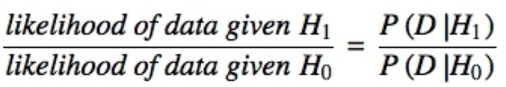

# Visual Statistical Analysis

In this chapter, we will learnt how to

-   ggstatsplot package to create visual graphics with rich statistical information,

-   performance package to visualise model diagnostics, and

-   parameters package to visualise model parameters

# Visual Statistical Analysis with ggstatsplot

[ggstatsplot](https://www.indrapatil.com/ggstatsplot/index.html) is an extension of ggplot2 package for creating graphics with details from statistical tests included in the information-rich plots themselves.

We will study how: - to provide alternative statistical inference methods by default. - to follow best practices for statistical reporting. For all statistical tests reported in the plots, the default template abides by the [APA](https://my.ilstu.edu/~jhkahn/apastats.html) gold standard for statistical reporting. For example, here are results from a robust t-test:

{#fig-example width="80%"}

```{r}
pacman:: p_load(ggstatsplot, tidyverse)
```

```{r}
exam <- read_csv("data/Exam_data.csv")
head(exam)
```

In the code chunk below, gghistostats() is used to to build an visual of one-sample test on English scores.

```{r}
set.seed(1234)

ggstatsplot::gghistostats(
  data = exam,
  x = ENGLISH,
  type = "bayes",
  test.value = 60,
  xlab = "English scores"
)

```

::: callout-important
the $r_{Cauchy}^{JZS} = 0.71$ indicates an objective, medium-width prior. This is a standard conservative choice in scientific research because it doesn't "over-hype" the results. It requires the data to be quite convincing to shift the Bayes Factor in favor of the alternative hypothesis.

The Bayesian T-test Hypothesis is also different from frequentist statistics

Null Hypothesis ($H_0$): The true mean English score is exactly equal to the benchmark value of 60,

Alternative Hypothesis ($H_1$): The true mean English score is not equal to 60.

I also want to touch upon how can we conclude for the above chart as an example as compared to frequentist statistic

The Bayesian one-sample t-test provides decisive evidence ($\log_e(BF_{01}) = -31.45$) that the English scores are significantly different from the benchmark, with the data more likely under the alternative hypothesis. The estimated average lift is 7.16 units ($\hat{\delta}_{difference}^{posterior}$), placing the most likely mean score at 74.74 ($\hat{\mu}_{MAP}$). Since the 95% credible interval of \[5.54, 8.75\] ($CI_{95\%}^{ETI}$) stays entirely on one side of the zero line, we can conclude with 95% certainty that there is a statistically significant and consistently positive improvement over the test value.
:::

## Unpacking the Bayes Factor

-   A Bayes factor is the ratio of the likelihood of one particular hypothesis to the likelihood of another. It can be interpreted as a measure of the strength of evidence in favor of one theory among two competing theories.

-   That’s because the Bayes factor gives us a way to evaluate the data in favor of a null hypothesis, and to use external information to do so. It tells us what the weight of the evidence is in favor of a given hypothesis.

-   When we are comparing two hypotheses, H1 (the alternate hypothesis) and H0 (the null hypothesis), the Bayes Factor is often written as B10. It can be defined mathematically as

{width="80%"}

Note: The [**Schwarz criterion**](https://www.statisticshowto.com/bayesian-information-criterion/) is one of the easiest ways to calculate rough approximation of the Bayes Factor.

## How to interpret Bayes Factor

A Bayes Factor can be any positive number. One of the most common interpretations is this one—first proposed by Harold Jeffereys (1961) and slightly modified by Lee and Wagenmakers in 2013:

{width="80%"}

## Two-sample mean test: ggbetweenstats()

```{r}
ggbetweenstats(
  data = exam,
  x = GENDER, 
  y = MATHS,
  type = "np",
  messages = FALSE
)
```

## Oneway ANOVA Test: ggbetweenstats() method

```{r}
ggbetweenstats(
  data = exam,
  x = RACE, 
  y = ENGLISH,
  type = "p",
  mean.ci = TRUE, 
  pairwise.comparisons = TRUE, 
  pairwise.display = "s",
  p.adjust.method = "fdr",
  messages = FALSE
)

```

::: callout-tip
for pairwise.display:

“ns” → only non-significant “s” → only significant “all” → everything
:::

## ggbetweenstats - Summary of tests

{width="80%"} {width="80%"} {width="80%"}

## Significant Test of Correlation: ggscatterstats()

```{r}
ggscatterstats(
  data = exam,
  x = MATHS,
  y = ENGLISH,
  marginal = FALSE,
  )
```

```{r}

exam1 <- exam %>% 
  mutate(MATHS_bins = 
           cut(MATHS, 
               breaks = c(0,60,75,85,100))
)
```

In this code chunk below ggbarstats() is used to build a visual for Significant Test of Association

```{r}
ggbarstats(exam1, 
           x = MATHS_bins, 
           y = GENDER)
```

