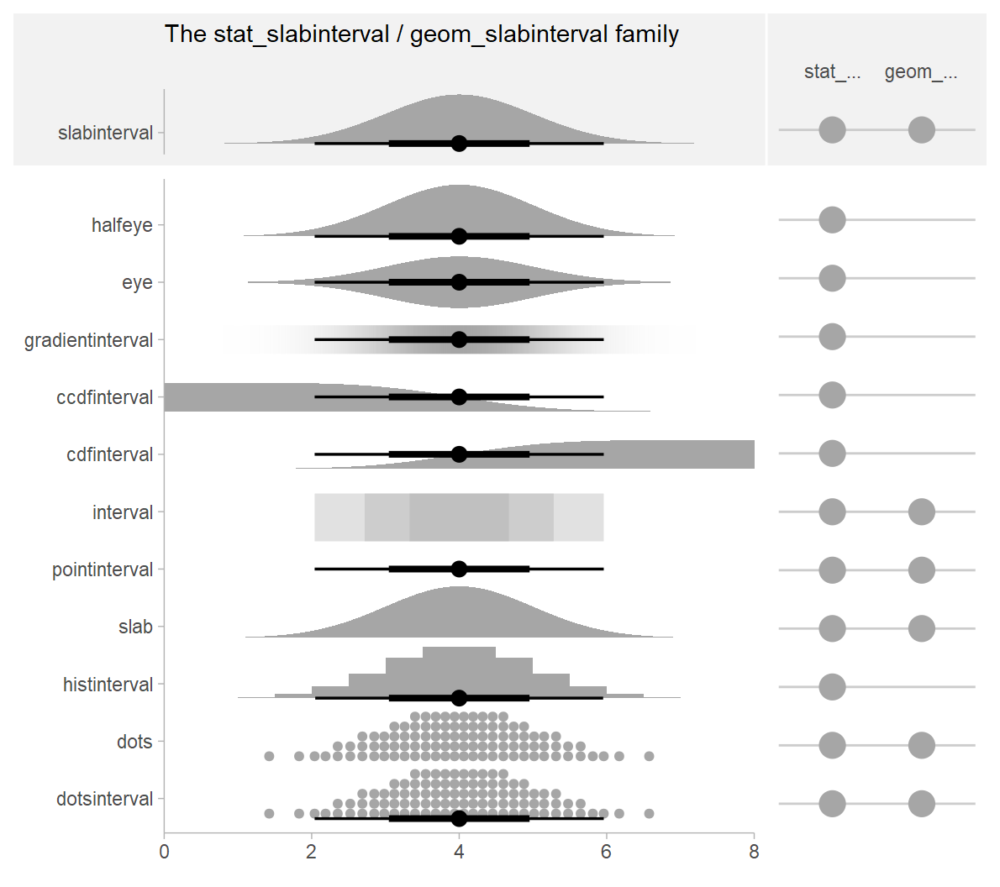
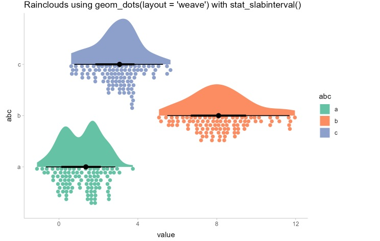
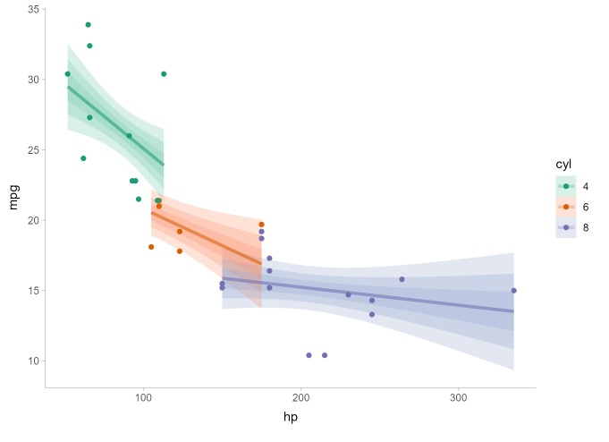

# Visualising Uncertainty

The objective is to - to plot statistics error bars by using ggplot2, - to plot interactive error bars by combining ggplot2, plotly and DT, - to create advanced by using ggdist, and - to create hypothetical outcome plots (HOPs) by using ungeviz package.

The following R packages will be used, they are:

-   [tidyverse](https://cran.r-project.org/web/packages/tidyverse/index.html), a family of R packages for data science process,
-   [plotly](https://cran.r-project.org/web/packages/plotly/index.html) for creating interactive plot,
-   [gganimate](https://cran.r-project.org/web/packages/gganimate/index.html) for creating animation plot,
-   [DT](https://cran.r-project.org/web/packages/DT/index.html) for displaying interactive html table,
-   [crosstalk](https://rstudio.github.io/crosstalk/) for for implementing cross-widget interactions (currently, linked brushing and filtering), and
-   [ggdist](https://cran.r-project.org/web/packages/ggdist/index.html) for visualising distribution and uncertainty.

```{r}
pacman::p_load(plotly, crosstalk, DT, 
               ggdist, ggridges, colorspace,
               gganimate, tidyverse)
```

```{r}
exam <- read_csv("data/Exam_data.csv")
head(exam)
```

## Visualising the uncertainty of point estimates: ggplot2 methods

A point estimate is a single number, such as a mean. Uncertainty, on the other hand, is expressed as standard error, confidence interval, or credible interval.

::: callout-important
## Important

-   Don't confuse the uncertainty of a point estimate with the variation in the sample
:::

We will plot error bars of maths scores by race by using data provided in exam tibble data frame.

```{r}
my_sum <- exam %>%
  group_by(RACE) %>%
  summarise(
    n=n(),
    mean=mean(MATHS),
    sd=sd(MATHS)
    ) %>%
  mutate(se=sd/sqrt(n-1))

```

::: callout-tip
## Things to learn from the code chunk above

-   `group_by()` of **dplyr** package is used to group the observation by RACE,
-   `summarise()` is used to compute the count of observations, mean, standard deviation
-   `mutate()` is used to derive standard error of Maths by RACE, and
-   the output is save as a tibble data table called *my_sum*.
:::

To display my_sum tibble data frame in an html table format.

```{r}
knitr::kable(head(my_sum), format = 'html')
```

## Plotting standard error bars of point estimates

```{r}
ggplot(my_sum) +
  geom_errorbar(
    aes(x=RACE, 
        ymin=mean-se, 
        ymax=mean+se), 
    width=0.2, 
    colour="black", 
    alpha=0.9, 
    linewidth=0.5) +
  geom_point(aes
           (x=RACE, 
            y=mean), 
           stat="identity", 
           color="red",
           size = 1.5,
           alpha=1) +
  ggtitle("Standard error of mean maths score by race")

```

## Plotting confidence interval of point estimates

Instead of plotting the standard error bar of estimates, we can also plot the confidence interval of mean maths score by race.

```{r}
ggplot(my_sum) +
  geom_errorbar(
    aes(x=reorder(RACE, -mean), 
        ymin=mean-1.96*se, 
        ymax=mean+1.96*se), 
    width=0.2, 
    colour="black", 
    alpha=0.9, 
    linewidth=0.5) +
  geom_point(aes
           (x=RACE, 
            y=mean), 
           stat="identity", 
           color="red",
           size = 1.5,
           alpha=1) +
  labs(x = "Maths score",
       title = "95% confidence interval of mean maths score by race")
```

::: callout-note
-   The confidence intervals are computed by using the formula mean+/-1.96\*se.
-   The error bars is sorted by using the average maths scores.
-   labs() argument of ggplot2 is used to change the x-axis label.
:::

## Visualizing the uncertainty of point estimates with interactive error bars

We will plot interactive error bars for the 99% confidence interval of mean maths score by race as shown in the figure below.

```{r}
shared_df = SharedData$new(my_sum)

bscols(widths = c(4,8),
       ggplotly((ggplot(shared_df) +
                   geom_errorbar(aes(
                     x=reorder(RACE, -mean),
                     ymin=mean-2.58*se, 
                     ymax=mean+2.58*se), 
                     width=0.2, 
                     colour="black", 
                     alpha=0.9, 
                     size=0.5) +
                   geom_point(aes(
                     x=RACE, 
                     y=mean, 
                     text = paste("Race:", `RACE`, 
                                  "<br>N:", `n`,
                                  "<br>Avg. Scores:", round(mean, digits = 2),
                                  "<br>95% CI:[", 
                                  round((mean-2.58*se), digits = 2), ",",
                                  round((mean+2.58*se), digits = 2),"]")),
                     stat="identity", 
                     color="red", 
                     size = 1.5, 
                     alpha=1) + 
                   xlab("Race") + 
                   ylab("Average Scores") + 
                   theme_minimal() + 
                   theme(axis.text.x = element_text(
                     angle = 45, vjust = 0.5, hjust=1)) +
                   ggtitle("99% Confidence interval of average /<br>maths scores by race")), 
                tooltip = "text"), 
       DT::datatable(shared_df, 
                     rownames = FALSE, 
                     class="compact", 
                     width="100%", 
                     options = list(pageLength = 10,
                                    scrollX=T), 
                     colnames = c("No. of pupils", 
                                  "Avg Scores",
                                  "Std Dev",
                                  "Std Error")) %>%
         formatRound(columns=c('mean', 'sd', 'se'),
                     digits=2))
```

## Visualising Uncertainty: ggdist package

-   [ggdist](https://mjskay.github.io/ggdist/index.html) is an R package that provides a flexible set of ggplot2 geoms and stats designed especially for visualising distributions and uncertainty.

-   It is designed for both frequentist and Bayesian uncertainty visualization, taking the view that uncertainty visualization can be unified through the perspective of distribution visualization:

-   for frequentist models, one visualises confidence distributions or bootstrap distributions (see vignette(“freq-uncertainty-vis”));

-   for Bayesian models, one visualises probability distributions (see the tidybayes package, which builds on top of [ggdist](https://mjskay.github.io/ggdist/index.html)).

The geom_slabinterval() / stat_slabinterval() family (see vignette("slabinterval")) makes it easy to visualize point summaries and intervals, eye plots, half-eye plots, ridge plots, CCDF bar plots, gradient plots, histograms, and more:



The [`geom_dotsinterval()`](https://mjskay.github.io/ggdist/reference/geom_dotsinterval.html) / [`stat_dotsinterval()`](https://mjskay.github.io/ggdist/reference/stat_dotsinterval.html) family (see [`vignette("dotsinterval")`](https://mjskay.github.io/ggdist/articles/dotsinterval.html)) makes it easy to visualize dot+interval plots, Wilkinson dotplots, beeswarm plots, and quantile dotplots (and combined with half-eyes, composite plots like rain cloud plots):



The [`geom_lineribbon()`](https://mjskay.github.io/ggdist/reference/geom_lineribbon.html) / [`stat_lineribbon()`](https://mjskay.github.io/ggdist/reference/stat_lineribbon.html) family (see [`vignette("lineribbon")`](https://mjskay.github.io/ggdist/articles/lineribbon.html)) makes it easy to visualize fit lines with an arbitrary number of uncertainty bands:\



All stats in [ggdist](https://mjskay.github.io/ggdist/) also support visualizing analytical distributions and vectorized distribution data types like [distributional](https://pkg.mitchelloharawild.com/distributional/) objects or [`posterior::rvar()`](https://mc-stan.org/posterior/reference/rvar.html) objects. This is particularly useful when visualizing uncertainty in frequentist models (see [`vignette("freq-uncertainty-vis")`](https://mjskay.github.io/ggdist/articles/freq-uncertainty-vis.html)) or when visualizing priors in a Bayesian analysis.

The [ggdist](https://mjskay.github.io/ggdist/) geoms and stats also form a core part of the [tidybayes](https://mjskay.github.io/tidybayes/) package (in fact, they originally were part of [tidybayes](https://mjskay.github.io/tidybayes/)). For examples of the use of [ggdist](https://mjskay.github.io/ggdist/) geoms and stats for visualizing uncertainty in Bayesian models, see the vignettes in [tidybayes](https://mjskay.github.io/tidybayes/), such as [`vignette("tidybayes", package = "tidybayes")`](https://mjskay.github.io/tidybayes/articles/tidybayes.html) or [`vignette("tidy-brms", package = "tidybayes")`](https://mjskay.github.io/tidybayes/articles/tidy-brms.html).


