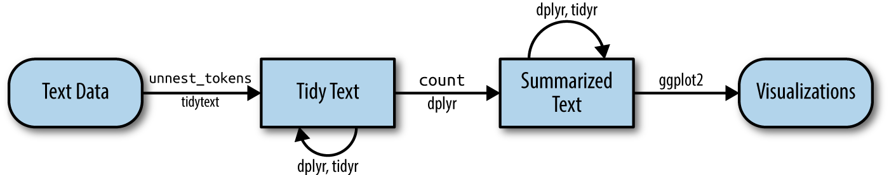
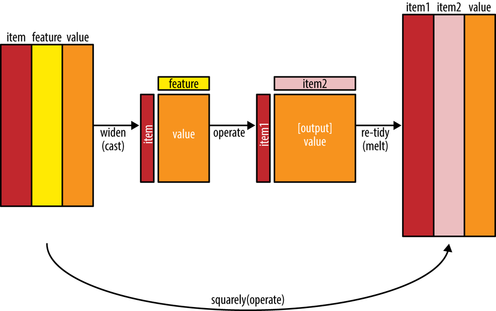

## Visualising and Analysing Text Data with R: tidytext methods

### Set up

In this hands-on exercise, the following R packages for handling, processing, wrangling, analysing and visualising text data will be used:

tidytext, tidyverse (mainly readr, purrr, stringr, ggplot2) widyr, wordcloud and ggwordcloud, textplot (required igraph, tidygraph and ggraph, ) DT, lubridate and hms.

```{r}
pacman::p_load(tidytext, widyr, wordcloud, DT, ggwordcloud, textplot, lubridate, hms,
tidyverse, tidygraph, ggraph, igraph)
```

### Define a function to read all files from a folder into a data frame

```{r}
read_folder <- function(infolder) {
  tibble(file = dir(infolder, 
                    full.names = TRUE)) %>%
    mutate(text = map(file, 
                      read_lines)) %>%
    transmute(id = basename(file), 
              text) %>%
    unnest(text)
}
```

### Importing Multiple Text Files from Multiple Folders

```{r}
raw_text <- tibble(folder = 
                     dir("data/20news", 
                         full.names = TRUE)) %>%
  mutate(folder_out = map(folder, 
                          read_folder)) %>%
  unnest(cols = c(folder_out)) %>%
  transmute(newsgroup = basename(folder), 
            id, text)
write_rds(raw_text, "data/news20.rds")
```

::: callout-note
### Things to learn from the code chunk above:

-   `read_lines()` of **readr** package is used to read up to `n_max` lines from a file.
-   `map()` of **purrr** package is used to transform their input by applying a function to each element of a list and returning an object of the same length as the input.
-   `unnest()` of **tidyr** package is used to flatten a list-column of data frames back out into regular columns.
-   `mutate()` of **dplyr** is used to add new variables and preserves existing ones;
-   `transmute()` of **dplyr** is used to add new variables and drops existing ones.
-   `write_rds()` is used to save the extracted and combined data frame as rds file for future use.
:::

## Initial EDA

```{r}

news20 <- readRDS("data/news20.rds")

raw_text <- news20
raw_text %>%
  group_by(newsgroup) %>%
  summarize(messages = n_distinct(id)) %>%
  ggplot(aes(messages, newsgroup)) +
  geom_col(fill = "lightblue") +
  labs(y = NULL)
```

## Introducing tidytext

-   Using tidy data principles in processing, analysing and visualising text data.
-   Much of the infrastructure needed for text mining with tidy data frames already exists in packages like ‘dplyr’, ‘broom’, ‘tidyr’, and ‘ggplot2’.

Figure below shows the workflow using tidytext approach for processing and visualising text data.



### Removing header and automated email signitures

```{r}
head(raw_text,20)
```

Notice that each message has some structure and extra text that we don’t want to include in our analysis. For example, every message has a header, containing field such as “from:” or “in_reply_to:” that describe the message. Some also have automated email signatures, which occur after a line like “–”.

```{r}
cleaned_text <- raw_text %>%
  group_by(newsgroup, id) %>%
  filter(cumsum(text == "") > 0,
         cumsum(str_detect(
           text, "^--")) == 0) %>%
  ungroup()
```

::: callout-note
- [cumsum()](https://rdrr.io/r/base/cumsum.html) of base R is used to return a vector whose elements are the cumulative sums of the elements of the argument.

- [str_detect()](https://stringr.tidyverse.org/reference/str_detect.html) from stringr is used to detect the presence or absence of a pattern in a string.
:::

### Removing lines with nested text representing quotes from other users.
In this code chunk below, regular expressions are used to remove with nested text representing quotes from other users.

```{r}
cleaned_text <- cleaned_text %>%
  filter(str_detect(text, "^[^>]+[A-Za-z\\d]")
         | text == "",
         !str_detect(text, 
                     "writes(:|\\.\\.\\.)$"),
         !str_detect(text, 
                     "^In article <")
  )
```

::: callout-note
- [str_detect()]((https://stringr.tidyverse.org/reference/str_detect.html) from stringr is used to detect the presence or absence of a pattern in a string.

- [filter()](https://dplyr.tidyverse.org/reference/filter.html) of dplyr package is used to subset a data frame, retaining all rows that satisfy the specified conditions.
:::

### Text Data Processing
In this code chunk below, unnest_tokens() of tidytext package is used to split the dataset into tokens, while stop_words() is used to remove stop-words.

```{r}
usenet_words <- cleaned_text %>%
  unnest_tokens(word, text) %>%
  filter(str_detect(word, "[a-z']$"),
         !word %in% stop_words$word)
```

Now that we’ve removed the headers, signatures, and formatting, we can start exploring common words. For starters, we could find the most common words in the entire dataset, or within particular newsgroups.

```{r}
usenet_words %>%
  count(word, sort = TRUE)
```

Instead of counting individual word, you can also count words within by newsgroup by using the code chunk below.

```{r}
words_by_newsgroup <- usenet_words %>%
  count(newsgroup, word, sort = TRUE) %>%
  ungroup()
```

### Visualising Words in newsgroups
In this code chunk below, wordcloud() of wordcloud package is used to plot a static wordcloud.

```{r}
wordcloud(words_by_newsgroup$word,
          words_by_newsgroup$n,
          max.words = 300)
```

A DT table can be used to complement the visual discovery.

```{r}

datatable(
  words_by_newsgroup,
  filter = "top", 
  rownames = TRUE, 
  colnames = c("newsgroup", "word", "n"), 
  options = list(
    pageLength = 10, 
    autoWidth = TRUE,
    dom = 'lfrtip', 
    initComplete = JS(
      "function(settings, json) {",
      "$(this.api().table().header()).css({'background-color': '#fff', 'color': '#222'});",
      "}"
    )
  ),
  class = "cell-border stripe" 
)
```

### Visualising Words in newsgroups
The wordcloud below is plotted by using ggwordcloud package.


The code chunk used:
```{r}
set.seed(1234)

words_by_newsgroup %>%
  filter(n > 5) %>%
ggplot(aes(label = word,
           size = n)) +
  geom_text_wordcloud() +
  theme_minimal() +
  facet_wrap(~newsgroup)
```

## Basic Concept of TF-IDF

[tf–idf](https://en.wikipedia.org/wiki/Tf%E2%80%93idf) short for term frequency–inverse document frequency, is a numerical statistic that is intended to reflect how important a word is to a document in a collection of
[corpus](https://en.wikipedia.org/wiki/Text_corpus)


### Computing tf-idf within newsgroups
The code chunk below uses bind_tf_idf() of tidytext to compute and bind the term frequency, inverse document frequency and ti-idf of a tidy text dataset to the dataset.

```{r}
tf_idf <- words_by_newsgroup %>%
  bind_tf_idf(word, newsgroup, n) %>%
  arrange(desc(tf_idf))
```

### Visualising tf-idf as interactive table
```{r}
datatable(
  tf_idf,
  filter = "top", 
  rownames = TRUE, 
  colnames = c("newsgroup", "word", "n"), 
  options = list(
    pageLength = 10, 
    autoWidth = TRUE,
    dom = 'lfrtip', 
    initComplete = JS(
      "function(settings, json) {",
      "$(this.api().table().header()).css({'background-color': '#fff', 'color': '#222'});",
      "}"
    )
  ),
  class = "cell-border stripe" 
)
```

### Visualising tf-idf as interactive table
The code chunk below uses datatable() of DT package to create a html table that allows pagination of rows and columns.

```{r}
DT::datatable(tf_idf, filter = 'top') %>% 
  formatRound(columns = c('tf', 'idf', 
                          'tf_idf'), 
              digits = 3) %>%
  formatStyle(0, 
              target = 'row', 
              lineHeight='25%')
```

::: {.callout-note}
## Things to learn from the code chunk:

* `filter` argument is used to control the filter UI.
* `formatRound()` is used to customise the values format. The argument *digits* define the number of decimal places.
* `formatStyle()` is used to customise the output table. In this example, the arguments *target* and *lineHeight* are used to reduce the line height by 25%.
:::

To learn more about customising DT’s table, visit this [link](https://rstudio.github.io/DT/functions.html).

### Visualising tf-idf within newsgroups
Facet bar charts technique is used to visualise the tf-idf values of science related newsgroup.

```{r}
tf_idf %>%
  filter(str_detect(newsgroup, "^sci\\.")) %>%
  group_by(newsgroup) %>%
  slice_max(tf_idf, 
            n = 12) %>%
  ungroup() %>%
  mutate(word = reorder(word, 
                        tf_idf)) %>%
  ggplot(aes(tf_idf, 
             word, 
             fill = newsgroup)) +
  geom_col(show.legend = FALSE) +
  facet_wrap(~ newsgroup, 
             scales = "free") +
  labs(x = "tf-idf", 
       y = NULL)
```


### Counting and correlating pairs of words with the widyr package

In this code chunk below, pairwise_cor() of widyr package is used to compute the correlation between newsgroup based on the common words found.

```{r}
newsgroup_cors <- words_by_newsgroup %>%
  pairwise_cor(newsgroup, 
               word, 
               n, 
               sort = TRUE)
```

## Visualising correlation as a network
```{r}
set.seed(2017)

newsgroup_cors %>%
  filter(correlation > .025) %>%
  graph_from_data_frame() %>%
  ggraph(layout = "fr") +
  geom_edge_link(aes(alpha = correlation, 
                     width = correlation)) +
  geom_node_point(size = 6, 
                  color = "lightblue") +
  geom_node_text(aes(label = name),
                 color = "red",
                 repel = TRUE) +
  theme_void()
```
### Bigram
In this code chunk below, a bigram data frame is created by using unnest_tokens() of tidytext.

```{r}
bigrams <- cleaned_text %>%
  unnest_tokens(bigram, 
                text, 
                token = "ngrams", 
                n = 2)
bigrams
```

### Counting bigrams

```{r}
bigrams_count <- bigrams %>%
  filter(bigram != 'NA') %>%
  count(bigram, sort = TRUE)
```

### Cleaning bigram
```{r}
bigrams_separated <- bigrams %>%
  filter(bigram != 'NA') %>%
  separate(bigram, c("word1", "word2"), 
           sep = " ")

bigrams_filtered <- bigrams_separated %>%
  filter(!word1 %in% stop_words$word) %>%
  filter(!word2 %in% stop_words$word)

bigrams_filtered
```

### Counting the bigram again

```{r}
bigram_counts <- bigrams_filtered %>% 
  count(word1, word2, sort = TRUE)
```

### Create a network graph from bigram data frame

In the code chunk below, a network graph is created by using graph_from_data_frame() of igraph package.

```{r}
bigram_graph <- bigram_counts %>%
  filter(n > 3) %>%
  graph_from_data_frame()
bigram_graph
```

The code chunk used to plot the network graph:
```{r}
set.seed(1234)

ggraph(bigram_graph, layout = "fr") +
  geom_edge_link() +
  geom_node_point() +
  geom_node_text(aes(label = name), 
                 vjust = 1, 
                 hjust = 1)
```

### Revised version
```{r}
set.seed(1234)

a <- grid::arrow(type = "closed", 
                 length = unit(.15,
                               "inches"))

ggraph(bigram_graph, 
       layout = "fr") +
  geom_edge_link(aes(edge_alpha = n), 
                 show.legend = FALSE,
                 arrow = a, 
                 end_cap = circle(.07,
                                  'inches')) +
  geom_node_point(color = "lightblue", 
                  size = 5) +
  geom_node_text(aes(label = name), 
                 vjust = 1, 
                 hjust = 1) +
  theme_void()
```

## References

### widyr

* Reference guide
    * [widyr: Widen, process, and re-tidy a dataset](https://juliaosilge.github.io/widyr/)
    * [United Nations Voting Correlations](https://cran.r-project.org/web/packages/widyr/vignettes/united_nations.html)
